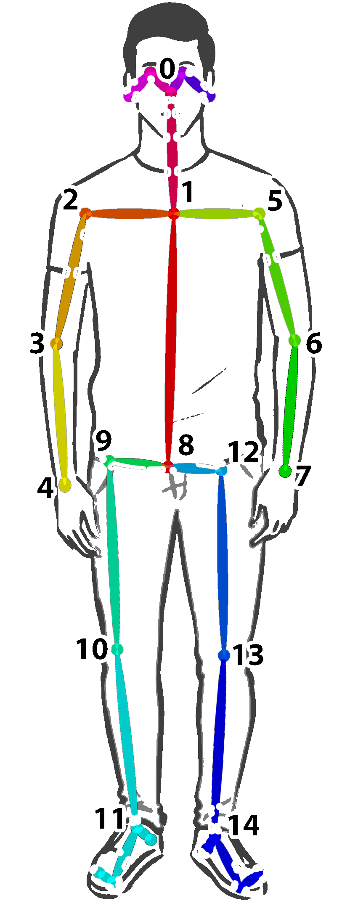
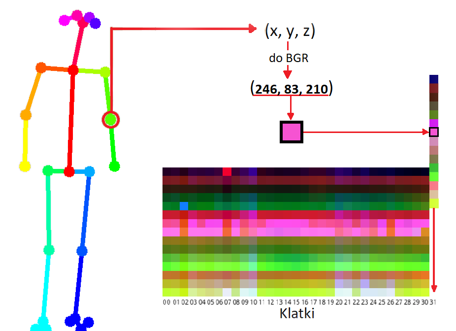
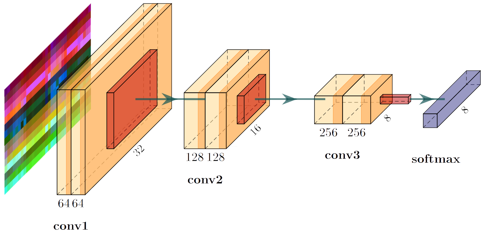
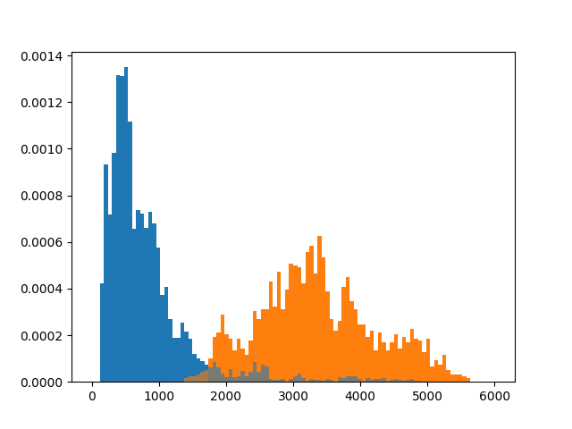

# Human Pose Classification - BEng Thesis

Please visit also [my website mmakos.pl](http://www.mmakos.pl/programming/hpc).

## Content
1. [About project](#about-project)
2. [Architecture](#architecture-basics)
3. [Requirements](#requirements)
4. [Usage](#working-with-available-modules)
   * [Running](#running)
   * [Data crearting and processing](#data-processing)
   * [Training](#training)
   * [Internal modules](#internal-modules)

## About project
Created system has to recognize human static and dynamic poses such as standing, walking, running itd.
As an input it takes video stream of RGBD camera (color and depth stream) from a robot.
Then, based on classified poses we can monitor human movement and e.g. detect falls.

## Architecture basics
Solution is based on body keypoints which are detected using [OpenPose](https://github.com/CMU-Perceptual-Computing-Lab/openpose) library\
\
System estimates human body's keypoints with OpenPose and converts them into small abstract image which represents theirs positions in 3D space trough multiple frames (so it's in facet 4D space).
Columns of this image represents sequent frames, rows represents different keypoints and color represent 3D position (B-x, G-y, R-D).
So example image for 15 keypoints, 32 frame, static pose with RGBD camera looks like: 

 Black fields represents not detected keypoints.

### CNN
I have used a smaller version of VGG net. It has few layers, but pretty similar construction.

### Hybrid solution
The best solution for now is splitting poses to two groups: static and dynamic. Before classification, skeleton is assigned to static or dynamic group and then it's classified by corresponding model. This preclassification is made based on distances between legs. Below, you can see the histogram of this distances for static (blue) and dynamic (orange) poses. As you can see, we can pretty accurately classify pose as static or dynamic using only the sum of distances between legs keypoints through 32 frames.

## Requirements
For now:
* Built OpenPose in folder `/externals/openpose/build`
* Python 3 (I work with 3.7 and I don't support other versions for now (e.g. OpenPose didn't work for me with Python 3.9) ) with libraries:
    * tensorflow
    * opencv-python
    * primesense (for *.oni* files and some RGBD sensors with OpenNI 2 support)
    * pyrealsense2 (for *.bag* files and RealSense sensor)
    * keyboard
    * numpy (comes with opencv) 
      *You can satisfy all above requirements by running script `requirements.bat`*
* For working with robot camera - Orbbec Astra SDK - OpenNI in folder `/externals`
* For working with RealSense camera - Realsense SDK.

## Working with (available modules)
For now I implemented modules to create datasets from saved RGBD video, training net and pose classification.

Dataset creating is done by estimation skeletons with OpenPose and then converting it to coded skeleton images with my algorithms (*proceedVideo* module).
Then a set of created images can be edited by hand by filtering wrong images, splitting it to labels and augmenting. Then final dataset is created to *.npz* file (compressed numpy arrays) ready to train (*createDataset* module).
Net training is done with *train.py* module.
Then you can classify pose with *estimateVideo.py*.

Both *estimateVideo.py* and *proceedVideo.py* modules works with *.bag* file (any RGBD stream saved by rospy library (used for RealSense sensor, by it can be used also for Tiago robot sensor), *.oni* files (not tested yet, doubt it will be used), regular video file (no depth frames though) and finally with images folder (images has to have on 4th position from end letter d for depth and c for color frame and has to be in alphabetical order).
*estimateVideo.py* module works with RealSense live stream as well.

Usage of above modules is described below. 
### Running
The only module that is needed for viewing stream from camera with estimated poses is run.py. This module is also an example of using this system by developers (it contains examples of getting data).

If you are a developer and you want to use that data some other way, you need to use wrapper and camera modules. Usage of that modules is shown in run.py module (with comments).

#### run.py
Module loads video and estimates poses for every human in every frame.

Usage: `python proceedVideo.py -v video -w write_name -c -p -g -d`:
* *video* - path to your video relative to running folder or to `/data/videos` folder. If none, program will try to run camera stream.
* *write_name* - name of output video (if you want to save proceeded video).
* *-c* - hybrid/cross - select if you want to use hybrid solution.
* *-p* - no pose - select this option if you don't want to estimate poses.
* *-g* - gpu mode - tensorflow will work on GPU. This is not default setting, because OpenPose use a lot of GPU memory, so it cannot run together with tensorflow.
* *-d* - no depth - select if you don't want to proceed depth information.

### Data processing
#### Dataset creation pipeline
Current general pipeline of creating dataset (pose is recorded pose and X is number of recording):
1. Create folders in /data/images and /data/videos for your data (`mkdir /data/images/example`, `mkdir /data/videos/example`). 
2. Record video as image sequence (finally it is the most universal format and the only one supported in all modules) with only one main skeleton:
    * `python recordVideo.py -v example/poseX -c` (-c for color preview).
    * press `s` to start recording (when camera is focused and you are ready)
    * press `q` to end recording
    * remember that path to your video must have slash on the end (`example/poseX/`)
3. Estimate keypoints and get annotation file:
    * `python proceedVideo.py example/poseX/ -p example/pose -k`
    * rename main skeleton file from s_atY.p to poseXatY.png and delete rest of skeletons (or you can rename it to poseX+1_atY.png etc. bu I recommend only one skeleton per video). Don't delete number after *at* - it is start frame of skeleton needed for proper synchronization of annotations with video.
4. Edit keypoints:
    * `python fillKeypoints example/poseX/ example/pose/poseXatY.p`
    * press *Skip* button to find next incomplete frame or go frame by frame using *Next* button.
    * press *Save* to save changes into file.
    * your file is writen as `poseXatY_f.p` (you can rename it to previous version file, but you will loose original annotations).
5. Create long images from annotations:
    * `python proceedVideo.py example/poseX/ -a example/pose/poseXatY_f.p -p example/pose -l`
    * you should receive one *.png* file `s0.png`. Rename it to `poseX.png`.
6. Repeat steps 1-5 to create another skeleton for your pose.
    * After that you should have bunch of images in `/data/images/example/pose/` folder named `pose0.png pose1.png` etc.
7. Create small images for training from created long images:
    * `python augument.py example/pose -o example/pose_Z` where *Z* is code of pose eg. for stand it's 0.
    * If you didn't type -o argument your short images will be stored in `/data/images/example/pose/pose_aug/` folder.
8. Repeat steps 1-7 for different poses.
    * After that you should have in your `/data/images/example/` folder bunch of folders named `stand_0 sit_1` etc.
9. Create dataset from all images:
    * `python createDataset.py example -d datasetName`.

#### recordVideo.py
Module records stream of RGBD camera and writes output to *.oni* file. Output video will be stored in `/data/videos`.

Usage: `python recordVideo.py -v video_name`:
* *video_name* - name of output video without extinction.

#### proceedVideo.py
Module takes recorded video in *.oni* or regular video format, estimates human skeletons and converts this skeletons into images.
Module also shows video with estimated skeletons.

Usage: `python proceedVideo.py video_path -p proceed -a annotations -v -w -l -k`:
* video_path - path to your video relative to running folder or to `/data/video` folder.
* proceed - proceed mode. Select this option when you want to code estimated skeletons to images. *Proceed* is name of folder where images will be saved (relative to `/data/images/` folder).
* annotations - skeletons will not be estimated. It will be loaded from annotation file with pickle extinction (*.p*) instead.
* -v - view mode. Select this option when you only want to view your video (without estimating skeletons. Useful for viewing *.oni* files or image sequences.
* -w - name of output video (if you want to save proceeded video). Useful to know which coded skeleton images correspond to which frame in proceeded video.
* -l - skeletons will be written into one long image instead of multiple small images for every frame. It can be easily proceeded with *augment* module.
* -k - skeleton annotations will be written into pickle file as absolute instead of encoding it to images. It can be then edited with *fillKeypoints.py* module.

#### fillKeypoints.py
Module is a simple keypoints annotations editor. Keypoints, which are not detected can be easily dragged to it's proper position.
Corrected annotations will be stored in file with input name + '_f'.

Usage: `python fillKeypoints.y video annotations`:
* video - path to video you want to open (it is independent of the keypoint annotations, so please make sure you typed correct path).
* annotations - path to file with keypoints annotations you want to correct.

Buttons:
* *Next* - next frame will be shown. Changes from previous will be saved (but not in the file yet).
* *Previous* - previous frame will be shown. Changes from previous frame will be saved (but not in the file yet).
* *Skip* - skips to next frame where not all keypoints are detected.
* *Save* - saves all made changes into file.
* *Reset* - resets all keypoints positions in current frame.

Point colors:
* *Green* - keypoints detected in annotations file (you can still drag it).
* *Red* - keypoint not detected in current frame (it appears on place from previous frame).
* *Purple* - keypoints has been edited. It will be saved after going to next frame.
On the down left corner of window you can see name of currently edited keypoint.
 

#### viewImagesAsVideo.py
Module shows skeleton images as video.

Usage: `python viewImagesAsVideo.py -s skeleton -f fps -z zoom`
* skeleton - index of skeleton to be shown
* fps - how many frames per second will be played
* zoom - factor by which every dimension will be multiplied

#### createDataset.py
Module create dataset from images to numpy file ready to train.

To properly generate dataset you have to store your images in folders named `<filename>_<label>` where *filename* can be anything but *label* is label of images according to *poses* table in *consts.py* file.
Then you have to move all this folders to move all this folders to one final folder. So it should look like this:
<pre>
poses
|--run_2
|  |--image1.png
|  |--image2.png
|--stand_0
|  |--image1.png
|--walk_1
</pre>

Usage: `python createDataset.py dataset_name -p poses -z`
* dataset_name - name of dataset you want to create.
* poses - path to your folder with labels subfolders relative to `/data` folder.
* -z - if this option is selected dataset will be stored in *.zip* format instead of *.npy*.

### Training
#### train.py
Module opens model or creates new one, trains it on given dataset in *.npz* format and saves trained model.

Usage: `python train.py dataset_name -m model_name -o output_model`
* dataset_name - name of data set on which you want to train your model.
* model_name - name of model, which will be opened or created if no such model exists
* output_model - name of output model, if model with that name exists it will be overwritten. If this arg is not specified model won't be saved.

### Internal modules
#### const.py
Module stores all constants:
* *frameWidth, frameHeight* - color frame dimensions, automatically set after running video stream
* *depthWidth, depthHeight* - depth frame dimensions, automatically set after running video stream with depth canal
* *frameDepth* - maximal depth of depth frame
* *framesNumber* - number of frames stored in one skeleton image
* *keypoints* - number of keypoints stored in one skeleton image
* *keypointThreshold* - threshold from which keypoints are proceeded
* *poses* - table of poses (labels)

#### frame.py
Class Frame stores all skeletons.
* *Frame.proceedFrame( humans )* - function proceeds single frame by updating tracked skeletons and estimate pose for every tracked skeleton. It returns array, where first element is array of pose probabilities and second element is id of skeleton.
* *Frame.proceedHuman( human, newSkeletons )* - internal function proceed detected skeletons
* *Frame.classifyPose( skeleton )* - function returns probability map for given skeleton
* *Frame.getSkeletons( humans )* - function proceed single frame and returns array of skeleton images. Function is equivalent od *proceedFrame* but for dataset creating.
* *getBoundingBox( keypoints )* - help function, returns size of bounding box for given keypoints in format ( width, height, depth )

#### skeleton.py
Class Skeleton stores single skeleton tracked through multiple frames.
* *Skeleton.updateSkeleton( keypoints )* - function updates skeleton with given keypoints
* *Skeleton.updateImg()* - internal function updates skeleton image by removing oldest frame and adding new one
* *Skeleton.compareSkeleton( keypoints, minDelta )* - function returns probability that given keypoints belongs to this skeleton.
* *Skeleton.getSkeletonImg()* - function returns skeleton image in numpy array format
* *Skeleton.getSkeletonId()* - function returns skeleton id. Skeletons stored in *Frame* class are not sorted, same as skeletons returned from *proceedFrame()* function.

#### model.py
Module creates network models.
* *getModel()* - function returns default model.

#### rgbdMap.py
* *mapToRGBD( keypoints, depthCanal )* - unction maps given keypoints of all humans to RGBD image. Keypoints are [ humans[ x, y, score ] ].
